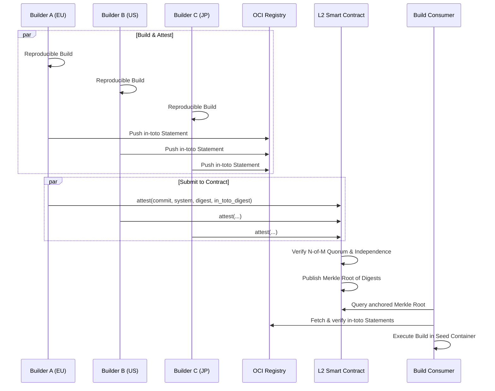

# Nix Seed: Design

> New to these terms? See [Glossary](./GLOSSARY.md).

Happy-path builds - application code change only, no dependency update - start
in under 10 seconds on any ephemeral runner. The dependency [closure] is already
packaged; pull, mount, build. No `/nix/store` reconstruction.

The setup tax of cold closure reconstruction is a one-time cost per seed, shared
across all subsequent jobs. Dependency changes trigger a seed rebuild;
everything else is free.

Every build is cryptographically bound to its source: what is in git is exactly
what was built. This is enforced by the linkage between source commit,
dependency closure, and output artifact - not assumed.

## Architecture

The release pointer is the OCI image digest
(`ghcr.io/org/repo.seed@sha256:<digest>`). [Registry][oci-registry] tags and
metadata are non-authoritative.

Layering is handled by [nix2container](https://github.com/nlewo/nix2container);
execution by workflow scripts external to the container.

> [!WARNING]
>
> **Guarantee boundary.** Nix Seed verifies reproducibility and provenance from
> declared inputs. It does not prove the absence of firmware implants,
> compromised hardware roots of trust, or malicious maintainers with valid
> signing authority. These threats require operational controls (key ceremony,
> hardware trust policy, personnel/process controls), not software-only fixes.

### Performance

- Closure realization is replaced by pulling and mounting an [OCI] filesystem
  image, dropping [CI] setup time from ~90 seconds (standard Nix cache fetch) to
  \<10 seconds.
- Setup cost scales with dependency change since the last seed.
- Source fetch (shallow clone size) is unchanged.
- Build execution time is unchanged.

<!-- TODO: link actual job runs from the examples. -->

#### Instrumentation

Jobs are instrumented with [OpenTelemetry] spans for:

- seed pull
- mount ready
- build start
- seed build (when a new seed is required before the app build)
- digest verification

Primary metric: time-to-build (setup time).

#### Comparisons

Nix Seed generates CI workflows that benchmark setup-time against cache-based
approaches (public binary cache, `actions/cache`) so the improvement is
measurable, not assumed.

The benchmark command is:

- `nix develop --command true`

#### Constraints

- Darwin builds must be run on macOS builders if they require Apple SDKs. A
  runner with a differing SDK version produces a differing NAR digest and fails
  deterministically.

### Build Output

Nix Seed's output is a Nix store path. The project build runs inside the seed
container and writes its result to the local Nix store. The release pointer is
the content-addressed digest of that output: a NAR digest for store path
outputs, an OCI image digest for container outputs. The trust and attestation
model is identical in both cases: the in-toto statement binds the output
artifact digest, and (in Zero) that digest is anchored on-chain.

For distribution, [Cachix](https://cachix.org/) provides a managed binary cache
service for store path results. Cachix push credentials are a deployment secret,
not a trust root. Container outputs are pushed to an OCI registry. Cachix is not
required when all outputs are container images; it is recommended for store path
outputs and dev shells.

Output references are system-qualified at evaluation time: `apps.default`
resolves to `apps.x86_64-linux.default` on an x86_64-linux builder. All
configured outputs are built in parallel. Projects with large independent
outputs should use separate CI jobs per output to distribute build load across
dedicated runners.

Nix store signing (`nix store sign`) attaches an [Ed25519] signature to each
[narinfo] in the cache, binding the store path to the signer's key. A consumer
configured with `trusted-public-keys` verifies the signature before accepting a
substituted path. In Zero, store signing is complementary to the on-chain
quorum: a compromised cache can serve a valid signature only if the signing key
is also compromised, while the anchored digest provides an independent ground
truth.

### Building Containers

> Nix Seed is not a container-building tool. Container images are one possible
> Nix derivation output. Their layers are store paths, packaged by
> [nix2container](https://github.com/nlewo/nix2container). Nothing about a
> container build is special relative to any other Nix output.

The release pointer for a container build is the OCI image digest
(`ghcr.io/org/repo@sha256:<digest>`). Registry tags and metadata are
non-authoritative. An OCI registry is required to store and distribute container
outputs; a CI provider with a co-located registry is preferred for performance.

`nix2container` is a pinned flake input; its digest is verified by the Nix build
system under the same supply-chain trust model as all other dependencies.

#### Seed Container

The seed container is the primary example: a standard `nix2container` build that
packages the project's dependency closure. It inherits all the properties above
\- its layers are store paths, its release pointer is an OCI image digest, and it
is stored in an OCI registry.

What distinguishes it is its purpose: it ships pre-built dependencies so the
project build can start immediately. The project output - store path, container
image, binary - is produced inside it.

Nix Seed itself is a pinned flake input, subject to the same supply-chain trust
model as everything it builds.

**Build steps:**

1. Evaluate the project's Nix closure.
1. `nix2container` produces an OCI image whose layers correspond to store paths,
   plus a metadata manifest containing the image digest.
1. Push the image to an OCI registry.

Seed builds are executed offline (`--network none`). Source retrieval MUST be
pinned to a commit digest (never a mutable branch ref). `flake.lock` integrity
is verified by Nix evaluation; mismatches fail by design.

### Trust

#### Bootstrap Chain

> The source was clean, the build hermetic, but the compiler was pwned.

The [Trusting Trust][trusting-trust] attack has no software fix. The only
protection is a compiler chain that terminates at a human-auditable ground
truth.

The Nixpkgs chain builds through:

- The initial binary, [stage0-posix](https://github.com/oriansj/stage0-posix), a
  self-hosting assembler whose bootstrap binary is a few hundred bytes of
  hex-encoded machine instructions - there is no opaque compiler binary to
  trust.
- [GNU Mes](https://www.gnu.org/software/mes/) - a minimal C compiler and Scheme
  interpreter bootstrapped entirely from the assembler
- [tcc](https://bellard.org/tcc/)
- [gcc](https://gcc.gnu.org/)
- [live-bootstrap](https://github.com/fosslinux/live-bootstrap).

The entire chain is coordinated with
[bootstrappable.org](https://bootstrappable.org/).

**Cost is already paid.** Full source bootstrap exists in nixpkgs regardless of
this project. Seed images cache its output: the first build after a seed update
pays the bootstrap cost once; subsequent CI jobs pull pre-built layers.

Consumers who need independent verification can rebuild from the stage0 binary,
reproduce the full closure, and check the digest against the anchored value.
This is a one-time audit activity that takes on the order of days of compute,
not a per-release operation. The content-addressed layers provide a direct
correspondence between what is pulled and what was built.

#### Quorum

> [!WARNING]
>
> Reproducible builds are a hard prerequisite. Without reproducibility,
> diverging digests are indistinguishable from a subverted build - the system
> cannot determine which builder is correct and quorum fails permanently.
>
> Verify with `nix build --check`. See
> [reproducible-builds.org](https://reproducible-builds.org/).

Releases require N-of-M builder agreement on the image digest. No single build
is trusted alone.

Quorum is only meaningful if builders span independent failure domains:
organization, jurisdiction, infrastructure, and identity issuer.

**Signing identity independence** requires that no single operator controls the
signing identities of multiple quorum builders. In Credulous, identity is
established via OIDC issuer: GitHub Actions
(`token.actions.githubusercontent.com`) and Azure Pipelines
(`vstoken.dev.azure.com`) share a Microsoft-controlled issuer and do not satisfy
identity independence when combined. In Zero, identity is established by
registered contract key; OIDC issuer is not a factor.

**Choosing N:** each of the N required builders should have a distinct
`corporateParent`, `jurisdiction`, and signing identity. N >= 3 is a practical
minimum; below that a single adversary controlling two independent entities can
forge a majority. Unanimous (M-of-M) is the strongest guarantee. See
[`modules/seedcfg.nix`](modules/seedcfg.nix) and
[`modules/builders.nix`](modules/builders.nix) for the builder registry schema.

**Timing:** in Credulous with N-of-M and a deadline, a party controlling M-N
builders can delay attestation to ensure the deciding N-th vote comes from a
builder of their choice. Zero eliminates this: attestations accumulate
indefinitely and quorum is declared when the threshold is met, not when a timer
expires.

Disagreement among builders is not a bug - it is the protocol. Release is
blocked until quorum agrees on the same digest.

#### Levels

##### Innocent

Single builder.

##### Credulous

> [!WARNING]
>
> Credulous depends on [Rekor] availability and external [OIDC] trust roots.
> N-of-M quorum requires a central actor, the "master builder", to coordinate
> the promotion flow.

Each project maintains a `.seed.lock` containing a digest per target system:

```json
{
  "aarch64-darwin": "sha256:...",
  "aarch64-linux": "sha256:...",
  "x86_64-darwin": "sha256:...",
  "x86_64-linux": "sha256:..."
}
```

If no digest exists for a system, the seed is built, the resulting digest is
recorded in a new commit containing the updated `.seed.lock`, and the normal
build proceeds.

After each build, an [in-toto] statement is generated describing inputs and
build metadata, signed via [OIDC]/[KMS] using [cosign], logged to [Rekor], and
published to the registry as a referrer artifact keyed by the build result
digest. No mutable registry state is trusted.

An SBOM (SPDX or CycloneDX) is generated from the output closure and published
as an OCI referrer artifact alongside the in-toto statement. This applies to
both seed builds and project builds.

At minimum, the statement must bind:

- source repository URI
- source commit digest
- flake.lock content digest
- target `system`
- output artifact digest
- SBOM digest
- builder identity and issuer
- build timestamp and workflow run ID

**Consumption:**

1. Read seed digest for the current system from `.seed.lock`.
1. Verify: attestation signature is valid; Rekor log inclusion is valid;
   statement contents match expected inputs.
1. Execute build steps in seed container by digest.

> [!WARNING]
>
> Rekor has no enterprise [SLA]. If Rekor is unavailable, quorum cannot be
> reached and builds fail.
>
> [!NOTE]
>
> Builder cache configuration ([substituters][substituter]) is not attested in
> Credulous. Two builders both substituting from the same cache (e.g.
> `cache.nixos.org`) are trusting the cache operator rather than independently
> building.

##### Zero

> The Mental Model: Think of Credulous as a high-speed local cache for your
> daily CI. Think of Zero as a global Clearing House for your software. The
> Ethereum L2 acts as the decentralized ledger where multiple independent
> auditors (builders) must mathematically agree on the output before a release
> is allowed to "clear."

###### No Substitutions

> [!WARNING]
>
> Each builder must build its closure locally from source with binary caches
> disabled. Build independence is the source of quorum's security guarantee: N
> builders on N independent stacks must all produce the same digest. If builders
> substitute from a shared cache, the cache operator, not N independent builds,
> is what produced the attested digest. The independence constraints the
> contract verifies (`corporateParent`, `jurisdiction`, infrastructure) are
> vacuous if all builders are serving the same pre-built [narinfo].
>
> As a direct result of this, bumping the core nixpkgs revision represents a
> massive compute wall. The builders must compile the entire bootstrap chain and
> standard environment from source.
>
> This is an unavoidable cost of cryptographic independence. When a seed bump
> occurs, quorum builders must provision FAT runners (high-compute, high-memory,
> long-running instances) to complete the "Epoch Build." Subsequent CI jobs for
> application code changes will return to near-zero setup times via the
> pre-built OCI layers.
>
> [!NOTE]
>
> The L2 contract maintains a builder revocation list. If a builder is
> retroactively found compromised, its identity is added to the list; the
> contract excludes its attestations from quorum counting. Prior seed releases
> that relied on the revoked builder should be re-evaluated.

<!-- AGENT: Builder federations work together to share the load and increase the
--> <!-- quorum? -->

A *seed release* is a set of image digests, one per target system. This is
distinct from a project release (git tag); a project release may reference one
or more seed releases.

The on-chain record is intentionally minimal to limit [calldata] cost. Each
builder additionally produces an [in-toto] statement binding full provenance:

- source repository URI
- source commit digest (full 40-hex SHA-1 or 64-hex SHA-256)
- `flake.lock` content digest
- target `system`
- output artifact digest
- SBOM digest
- builder identity (contract address)
- build metadata (`nix show-config` output, workflow run ID)

Each builder signs the statement with its registered key (not [OIDC]) and
publishes it to the OCI registry as a referrer artifact keyed by the build
result digest. An SBOM (SPDX or CycloneDX) is generated from the output closure
and published as a separate OCI referrer artifact. [Rekor] is not used; the OCI
registry hosts the provenance. The contract anchor proves N builders agreed on
the digest; the in-toto statements prove what was built.

Registry operators MUST guarantee referrer retention and API support required to
retrieve provenance for the full artifact lifetime. Production deployments
SHOULD replicate provenance artifacts to a secondary registry or immutable
archive to reduce single-registry loss/corruption risk.



Storing the full in-toto statement on-chain is feasible but not recommended. A
typical statement is 1,000-2,000 bytes; at 16 gas per non-zero calldata byte
that adds roughly 16,000-32,000 gas per builder per system - a 10-20x increase
in calldata cost - and bloats L2 data availability. Instead, the statement
digest is anchored on-chain (32 bytes, negligible cost) as a fourth parameter
`attest(commit, system, digest, in_toto_digest)`. This binds the off-chain
provenance to the quorum record without the size cost.

Each builder holds a persistent signing key registered in the contract at
genesis. A build produces a single on-chain transaction:

```solidity
attest(commit, system, digest, in_toto_digest)
```

signed by the builder's registered key. The contract records
`(commit, system, digest, in_toto_digest, builder_address, block_number)` for
each submission, then:

1. Checks that N distinct registered builders have submitted the same
   `(commit, system, digest, in_toto_digest)` tuple.
1. Verifies independence constraints across the N builders (`corporateParent`,
   `jurisdiction`, infrastructure, substituters).
1. When quorum is satisfied across all target systems, publishes the digest tree
   as a single [Merkle root][merkle-root]:
   - hash function = `keccak256`
   - leaf bytes =
     `0x00 || u16be(len(system)) || utf8(system) || imageDigestBytes`
   - internal node bytes = `0x01 || leftHash || rightHash`
   - leaf order = lexical ascending by `system`
   - odd leaf handling = duplicate the final leaf at each level
   - root = Merkle root across all systems
1. The anchored root is immutable.

No deadline is required. The contract accumulates attestations indefinitely;
quorum is declared when the threshold is met. The blockchain is the transparency
log - no separate log service is required.

**Master-builder trust is eliminated from the promotion path.** The contract
promotes a release when quorum is met - no coordinator, no single point of
authority.

**Key management:** builder keys are persistent secrets held in CI secret
stores. In Zero, signing keys SHOULD be non-exportable and backed by HSM/KMS-HSM
class infrastructure if costs permit. Raw private keys stored directly in CI
secret stores are NOT RECOMMENDED for Zero. Compromise triggers revocation via
the contract's governance [multi-sig] (see
[Governance Constraints](#governance-constraints)).

**Why CI key compromise still matters:** the contract verifies that `N` distinct
registered builder keys signed the same tuple. It does not distinguish an
authorized signer from an attacker using a stolen key. If fewer than `N` keys
are compromised, quorum blocks promotion; if `N` or more are compromised, a
malicious digest can satisfy quorum until revocation occurs.

Builders must enforce `substituters =` (empty) and `trusted-substituters =`
(empty). The effective `nix show-config` output is included in the in-toto
statement so verifiers can reject substituted builds.

Verifier policy MUST fail closed on any of the following:

- missing in-toto statement, signature, or signature-chain verification failure
- signer identity not in registered builder set
- missing required predicate fields (source URI, commit digest, `flake.lock`
  digest, target `system`, output digest)
- source URI/commit/`flake.lock` mismatch versus expected build inputs
- `nix show-config` indicates non-empty `substituters` or `trusted-substituters`
- missing or invalid inclusion proof for the anchored per-system digest

> [!NOTE]
>
> The L2 contract verifies the *claim* of independence via attested build
> metadata, not a cryptographic proof of local execution. A compromised builder
> can spoof its `nix show-config` output. Quorum still limits the damage: this
> only matters if N or more builders are simultaneously compromised and
> coordinating the same lie.

The `.seed.lock` file is not used.

**Consumption:** The contract must not be empty; see [Genesis](#genesis).

1. Query the L2 contract for the current anchored Merkle root.
1. Fetch the off-chain Merkle inclusion proof and verify it against the
   L2-anchored root.
1. Fetch in-toto provenance statements from OCI artifact; verify each signature
   against the builder's registered contract address; verify statement contents
   match expected source URI, commit, and `flake.lock` digest.
1. Execute build steps in seed container by digest.

Contract quorum verification subsumes the Rekor log check. In-toto provenance is
verified separately via the OCI artifact.

###### Configuration Registry

The contract is the authoritative source for all verification parameters:
builder set, registered keys, N, M, and independence constraints
(`corporateParent`, `jurisdiction`, infrastructure).

The flake's `seedCfg` is a local declaration used for Credulous only. It should
be pruned when moving to Zero.

Changes take effect only when a governance transaction updates the contract,
requiring approval from the governance multi-sig (see
[Governance Constraints](#governance-constraints)).

This closes the obvious attack: repo write access does not confer the ability to
redefine the trust model. Genesis (below) is the ceremony that populates the
registry for the first time.

###### RPC availability

Contract reads are `eth_call` (view functions) - no transaction, no gas,
50-300ms on a reliable L2 RPC provider. Not a CI bottleneck. The real concern is
availability: if the RPC is down, verification fails closed and builds stop.
Mitigations:

- Configure multiple RPC endpoints; fail through to a secondary on error.
- Cache the last known Merkle root locally with its block number; re-fetch on
  block advance.
- Apply the same jurisdiction independence requirement to RPC providers as to
  builders: a single US-provider RPC is a single failure domain.

###### Genesis

The first seed has no prior quorum to bootstrap from. Genesis is a controlled
ceremony distinct from normal builds:

1. All configured builders (M-of-M, unanimous) build the seed independently from
   source.
1. Each builder submits a genesis attestation to the contract via their
   registered key.
1. The contract requires unanimous attestation and verifies full independence
   across all M builders before accepting the genesis root.
1. Genesis is finalized by a multi-signature transaction requiring all M builder
   keys; no single party can unilaterally declare genesis.
1. An empty contract state rejects all non-genesis builds. Genesis must be
   completed before any seed can be consumed.

Post-genesis builds use the standard N-of-M threshold. The genesis root is the
immutable trust anchor.

Operationally, deployments MUST maintain incident runbooks for: key loss,
builder unavailability, builder compromise/revocation, and emergency quorum
reconfiguration.

> [!NOTE]
>
> Air-gapping builder hardware during the genesis ceremony eliminates the risk
> of network-level attacks on the trust anchor. This is best practice but
> expensive. Firmware injection remains a risk.

###### Gas Costs

[Gas] cost depends on [calldata] size, state writes, and current L2 fee
conditions. The ranges below are planning estimates for a quorum of 3 builders
across 4 systems (`aarch64-darwin`, `aarch64-linux`, `x86_64-darwin`,
`x86_64-linux`), not guarantees.

- `attest(commit, system, digest, in_toto_digest)` submission (per builder per
  system):
  - expected gas: 120,000 to 220,000
  - expected cost: 0.00006 to 0.00022 ETH
  - expected USD (ETH = $3,000): $0.18 to $0.66
- total attestations (3 builders x 4 systems = 12 submissions):
  - expected gas: 1,440,000 to 2,640,000
  - expected cost: 0.00072 to 0.00264 ETH
  - expected USD (ETH = $3,000): $2.16 to $7.92
- root publication (once quorum is met for all 4 systems):
  - expected gas: 180,000 to 320,000
  - expected cost: 0.00009 to 0.00032 ETH
  - expected USD (ETH = $3,000): $0.27 to $0.96

Total anchoring overhead per release: 0.00081 to 0.00296 ETH ($2.43 to $8.88 at
ETH = $3,000), excluding unusual fee spikes.

###### Governance Constraints

- Governance multi-sig must be independent from builder keys.
- Threshold should be at least 2-of-3 for emergency revocation/rotation.
- If a genesis key is lost before finalization, restart genesis with a new
  builder set and publish a signed incident record.
- If keys are lost post-finalization such that the multi-sig drops below the
  rotation threshold (e.g., 2-of-3), the L2 contract is permanently bricked for
  that project and requires a hard fork to a new contract.
- If a builder is revoked post-genesis, re-evaluate affected releases and
  republish status.

## Implicit Trust Boundary

While the design mitigates many attack vectors, it relies on two fundamental
trust assumptions:

1. **The `flake.lock` Bottleneck:** Nix Seed guarantees *what is in git is what
   is built*. If a maintainer merges a malicious dependency update into
   `flake.lock`, Nix Seed will faithfully build, attest, and anchor the malware.
   The cryptographic system does not audit code intent; it only binds the output
   to the input. Human review of lockfile updates remains a critical security
   boundary.
1. **Registry Tampering:** The OCI registry is treated as an untrusted blob
   store. The trust boundary assumes the local OCI client (Docker/Podman/
   Skopeo) correctly verifies that the digest of the fetched content matches the
   requested digest. We trust the math of content-addressing, not the service
   providing the bytes.

The [xz-utils backdoor (2024)](https://tukaani.org/xz-backdoor/) demonstrated
that highly resourced, patient adversaries will execute multi-year social
engineering campaigns to compromise a single maintainer's trust. However, Nix
Seed fundamentally alters the adversary's risk profile:

1. **No Silent CI Injections:** The attacker cannot silently compromise a build
   runner to inject a payload into the artifact. They *must* commit the backdoor
   to the public Git repository to pass the N-of-M quorum digest check.
1. **Forced Attribution:** By forcing the attack into the source tree, the
   adversary's actions become a publicly auditable Git crime. The malicious
   artifact is permanently, cryptographically bound to the specific commit and
   the identities of the independent builders who attested to it.

[HUMINT] recruitment of build-system maintainers is not addressed by any
technical control. Key ceremony discipline and [HSM]-resident keys limit insider
blast radius: an insider can attest a bad build, but cannot retroactively forge
the quorum.

## Project Attack Surface

This project is intentionally low-code: it mainly defines build policy,
verification rules, and workflow wiring around existing Nix container systems.
That limits direct application attack surface because there is little custom
runtime logic to exploit.

The primary risk is **misconfiguration**, not complex code execution. The
highest-impact failure modes are:

- weak quorum/independence configuration
- enabling [substituters][substituter] in [L2] mode
- trusting unsigned or under-specified [attestations][attestation]
- insecure key handling in CI

Security work should prioritize strict defaults, immutable references,
verification-by-default, and auditable configuration.

## Governance

This project aims to become part of the
[nix-community](https://github.com/nix-community). Nix Community hosts projects
under [shared ownership](https://nix-community.org/), supporting multi-person
authorisation over releases and repository access. This aligns with the trust
model: the project's own supply chain is subject to the same independence
constraints it imposes on its users.

## Versioning

Releases are tagged twice: once as `N` (e.g. `1`) and once as `vN` (e.g. `v1`),
both pointing to the same commit. The `v` prefix is a cargo-cult convention
inherited from shell scripting era filenames; it carries no semantic content.
The canonical tag is `N`. The `vN` alias exists because GitHub Actions consumers
expect it - `uses: org/repo@v1` is the pattern every GHA user has memorised.
Both refs resolve identically.

## Compliance

Seed images fully respect upstream licences prohibiting redistribution. Seed
images do not contain the Apple SDK, they reference it at build time and on
macOS hosts.

[attestation]: https://slsa.dev/attestation-model
[calldata]: https://ethereum.org/en/developers/docs/transactions/
[ci]: https://en.wikipedia.org/wiki/Continuous_integration
[closure]: https://nix.dev/manual/nix/stable/glossary#gloss-closure
[cosign]: https://docs.sigstore.dev/cosign/overview/
[ed25519]: https://ed25519.cr.yp.to/
[gas]: https://ethereum.org/en/developers/docs/gas/
[hsm]: https://en.wikipedia.org/wiki/Hardware_security_module
[humint]: https://en.wikipedia.org/wiki/Human_intelligence_(intelligence_gathering)
[in-toto]: https://in-toto.io/
[kms]: https://csrc.nist.gov/pubs/sp/800/57/pt1/r5/final
[l2]: https://ethereum.org/en/layer-2/
[merkle-root]: https://en.wikipedia.org/wiki/Merkle_tree
[multi-sig]: https://en.wikipedia.org/wiki/Threshold_cryptosystem
[narinfo]: https://nix.dev/manual/nix/stable/package-management/binary-cache-substituter
[oci]: https://opencontainers.org/
[oci-registry]: https://github.com/opencontainers/distribution-spec
[oidc]: https://openid.net/connect/
[opentelemetry]: https://opentelemetry.io/
[rekor]: https://github.com/sigstore/rekor
[sla]: https://en.wikipedia.org/wiki/Service-level_agreement
[substituter]: https://nix.dev/manual/nix/stable/command-ref/conf-file#conf-substituters
[trusting-trust]: https://dl.acm.org/doi/10.1145/358198.358210
